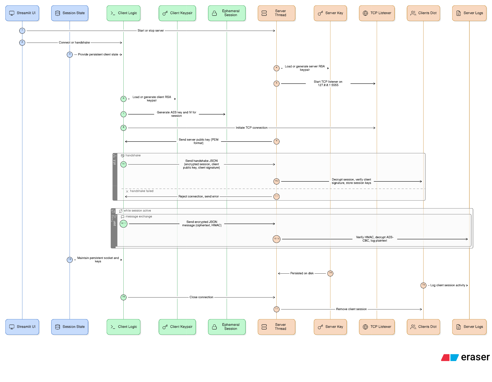

# Secure Chat — README

## High-level summary (one-liner)
The server generates/loads an RSA keypair and listens for TCP connections; a client connects, establishes an ephemeral AES session (encrypted with the server RSA key and signed by the client), and both sides then exchange AES-CBC + HMAC-SHA256 protected JSON messages over a persistent TCP connection.


## Files in this project
- `d:\secure_chat\server.py` — server implementation, RSA key persistence, handshake, per-connection session state, message receive loop.
- `d:\secure_chat\client.py` — client implementation and Streamlit UI (keeps socket in session_state for persistent session).
- `d:\secure_chat\main.py` — Streamlit UI glue that runs server in a background thread and exposes controls (start/stop server, connect/disconnect client, send messages).

## What the program does (step-by-step)
1. Server boots and loads or generates a long-term RSA keypair (persisted to `server_key.pem`).
2. Client connects via TCP.
3. Server immediately sends its RSA public key framed as:
   ```
   SERVER_PUB\n<server-public-pem>\n\n
   ```
   (the `\n\n` sequence is used as the message terminator).
4. Client generates an ephemeral AES session:
   - AES key = 32 random bytes (AES-256)
   - IV = 16 random bytes
   - `session_blob = AESkey || IV`
5. Client encrypts `session_blob` with the server RSA public key using RSA-OAEP (SHA-256).
6. Client signs `session_blob` using its own RSA private key with PSS (SHA-256).
7. Client sends a JSON handshake (terminated by `\n\n`):
   ```
   {
     "enc_session": "<base64 RSA-OAEP(session_blob)>",
     "client_pub": "<base64 client public PEM>",
     "client_sig": "<base64 signature>"
   }
   ```
8. Server:
   - base64-decodes fields,
   - decrypts `enc_session` with its RSA private key to recover AES key and IV,
   - verifies `client_sig` using the provided `client_pub`,
   - on success, stores per-connection state and accepts encrypted messages persistently on the same socket.
9. Client and server exchange encrypted messages formatted as JSON messages (each terminated with `\n\n`):
   ```
   {
     "cipher": "<base64 of AES-CBC ciphertext>",
     "hmac":   "<base64 of HMAC-SHA256 tag>"
   }
   ```

## Wire message formats (concise)
- Server public key header:
  - `SERVER_PUB\n<PEM>\n\n`
- Handshake JSON (client → server, terminated `\n\n`):
  - enc_session, client_pub, client_sig (all base64-encoded)
- Encrypted message JSON (terminated `\n\n`):
  - cipher: base64 AES-CBC ciphertext (PKCS#7 padded)
  - hmac: base64 HMAC-SHA256 computed over the ciphertext using the session key

## Where state lives
- Server long-term RSA key: `server_key.pem` (persisted on disk).
- Per-connection server state: global `clients` dict in `server.py` mapping `conn` → `{aes_key, aes_iv, client_pub, addr}`.
- Streamlit client state: `st.session_state` stores the active socket and message queue so the client remains connected across reruns.
- Server thread: started via `start_server()` and runs accept loop in a daemon thread; each connection has a handler thread.

## Security notes — what the demo gets right
- Uses RSA-OAEP to protect the session blob (confidentiality).
- Uses RSA-PSS signatures for client authenticity.
- Uses AES for bulk encryption and HMAC-SHA256 for integrity.

## Important simplifications / limitations (do NOT use this as production TLS)
- HMAC key reuse: AES session key is reused as the HMAC key; proper designs derive separate keys (HKDF).
- No forward secrecy: session encrypted using server's long-term RSA key (no ephemeral DH/ECDHE).
- Single IV reuse for the session: re-using the same IV for multiple AES-CBC messages is insecure.
- No replay protection or per-message sequence numbers.
- Ad-hoc framing: `\n\n` terminator is brittle for binary protocols.
- No certificate validation / trust model: a MitM can substitute keys unless client has an out-of-band trust anchor.
- No per-message nonce rotation; consider AEAD ciphers (AES-GCM/ChaCha20-Poly1305).

## Suggested improvements (practical next steps)
- Use ephemeral ECDHE for forward secrecy.
- Use HKDF to derive distinct encryption and MAC keys from a shared secret.
- Switch to AEAD (AES-GCM or ChaCha20-Poly1305) to avoid separate HMAC and IV-handling.
- Rotate or include per-message nonces/IVs (do not reuse IVs for CBC).
- Add sequence numbers and anti-replay logic.
- Use length-prefixed framing instead of delimiter-based framing.

## Running the Streamlit UI (quick checklist)
1. Start the UI:
   ```
   streamlit run d:\secure_chat\main.py
   ```
2. In the Streamlit sidebar:
   - Click "Start server" — server listens on configured host/port and writes `server_key.pem` if missing.
   - Click "Connect client" — client will perform the handshake and keep a socket in `st.session_state`.
3. In the main panel:
   - Type messages and click "Send" — messages are encrypted and sent over the established session.
   - Server logs will show decrypted plaintext lines until session end.
4. Click "Stop server" or "Disconnect client" to end the session.

## TL;DR
A simplified TLS-like demo:
- Server announces RSA public key.
- Client encrypts an ephemeral AES key+IV with RSA-OAEP and signs it.
- Server decrypts, verifies signature, and both sides then exchange AES-CBC-encrypted messages with HMAC-SHA256 over a persistent TCP connection.
- Streamlit UI keeps server thread and client socket alive so you can exercise the handshake and multiple message exchanges interactively.

<!-- End of README -->
